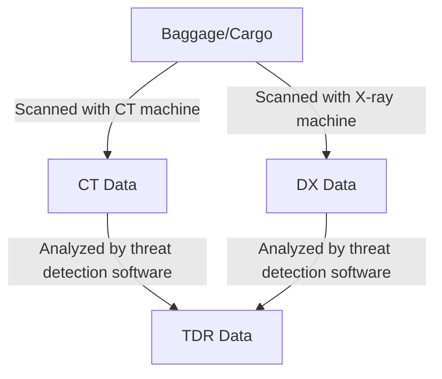
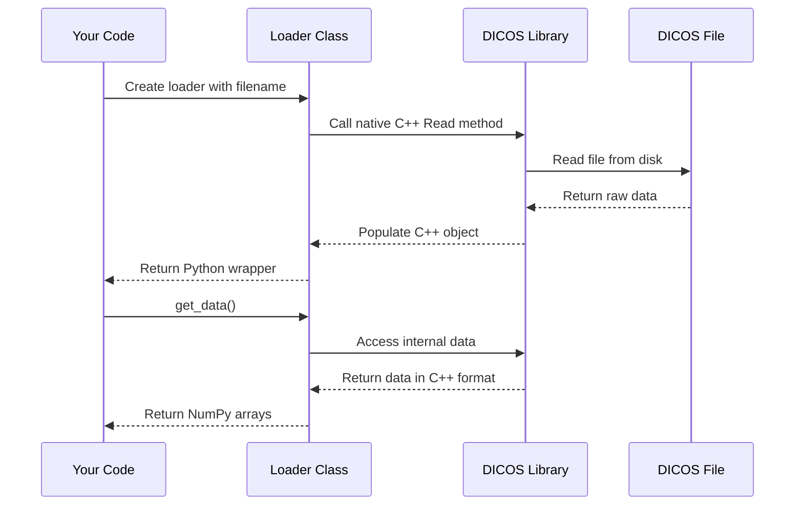

# Chapter 1: DICOS Data Types (CT, DX, TDR)

Welcome to the first chapter of our pyDICOS tutorial! If you're involved in security screening, threat detection, or simply working with security imaging data, this library will make your life much easier.

## What is DICOS?

DICOS (Digital Imaging and Communications for Security) is to security screening what DICOM is to medical imaging - a standardized way to store, transmit, and work with complex security scan data. Think of it as a specialized file format designed specifically for security applications like airport baggage screening or cargo inspection.

## Understanding the Core DICOS Data Types

Let's imagine you work at an airport security checkpoint. You have different scanning machines that produce various types of data:



pyDICOS provides you with three primary data types to handle this workflow:

### 1. CT (Computed Tomography)

**What it is:** 3D volumetric scan data, typically from baggage scanners at airports or cargo inspection systems.

Think of CT as a stack of 2D image slices that together form a 3D representation of an object. Just like medical CT scans show the interior of a human body, security CT scans reveal the contents of baggage or cargo in three dimensions.

**Example:** Loading and viewing a CT scan:

```python
from pyDICOS import CTLoader
import matplotlib.pyplot as plt

# Load a CT scan file
ct_data = CTLoader("baggage_scan.ct")

# Get the 3D volume data
volume_data = ct_data.get_data()

# Display a slice from the middle of the volume
middle_slice_idx = len(volume_data[0]) // 2
plt.imshow(volume_data[0][middle_slice_idx], cmap='gray')
plt.title(f"CT Slice {middle_slice_idx}")
plt.show()
```

This code loads a CT scan file, extracts the 3D volume data, and displays a cross-sectional slice from the middle of the scan.

### 2. DX (Digital X-ray)

**What it is:** 2D X-ray images, similar to what you see on the monitor when your bag goes through the X-ray machine at an airport.

Unlike CT, DX provides a single 2D projection of an object, with overlapping structures visible in the image.

**Example:** Loading and viewing a DX image:

```python
from pyDICOS import DXLoader
import matplotlib.pyplot as plt

# Load a DX image file
dx_data = DXLoader("baggage_xray.dx")

# Get the 2D image data
image_data = dx_data.get_data()

# Display the X-ray image
plt.imshow(image_data, cmap='gray')
plt.title("X-ray Image")
plt.show()
```

This code loads a DX file, extracts the 2D image data, and displays it as a grayscale image.

### 3. TDR (Threat Detection Reports)

**What it is:** Contains information about detected threats within CT or DX scans.

While CT and DX contain the raw imaging data, TDR files store information about potential threats identified in those scans, including location, type, and confidence level.

**Example:** Loading and analyzing a threat report:

```python
from pyDICOS import TDRLoader

# Load a TDR file
tdr_data = TDRLoader("baggage_threats.tdr")

# Get all the threat data
threat_info = tdr_data.get_data()

# Print information about detected threats
for i, pto in enumerate(threat_info["PTOs"]):
    print(f"Threat #{i+1}:")
    print(f"  Location: {pto['Base']}")
    print(f"  Size: {pto['Extent']}")
    print(f"  Probability: {pto['Assessment']['probability']}")
    print(f"  Category: {pto['Assessment']['category']}")
    print()
```

This code loads a TDR file, extracts information about all detected threats (PTOs - Potential Threat Objects), and prints details about each threat's location, size, detection probability, and category.

## Relationship Between Data Types

These three data types work together in a typical security screening workflow:

1. A CT or DX scan is performed on an object (baggage, cargo, etc.)
2. Automated threat detection algorithms analyze the scan
3. Results are stored in a TDR file, which references the original scan

In fact, you can generate a TDR from a CT scan with detected threats:

```python
from pyDICOS import CTLoader
import numpy as np

# Load a CT scan
ct_scan = CTLoader("baggage_scan.ct")

# Define a threat (simplified example)
threat_data = {
    "InstanceNumber": 1,
    "AlarmDecision": 1,  # 1 = Alarm
    "PTOs": [{
        "ID": 1,
        "Base": {"x": 100, "y": 150, "z": 30},
        "Extent": {"x": 50, "y": 40, "z": 20},
        "Assessment": {
            "flag": 2,  # 2 = Threat
            "category": 1,  # 1 = Explosive
            "probability": 0.92
        }
    }]
}

# Generate a TDR file from the CT scan and threat data
tdr = ct_scan.generate_tdr(threat_data, "detected_threats.tdr")
```

This example shows how you might take a CT scan, add information about a detected threat, and generate a TDR file that links back to the original scan.

## Under the Hood: How pyDICOS Processes DICOS Files

When you work with DICOS files in pyDICOS, here's what happens behind the scenes:



pyDICOS is actually a Python wrapper around a C++ library that implements the DICOS standard. The loader classes (`CTLoader`, `DXLoader`, `TDRLoader`) provide a Pythonic interface to this C++ library.

For example, when you call `CTLoader("file.ct")`, these steps occur:
1. The Python wrapper creates a C++ CT object
2. It calls the C++ Read method with the filename
3. The C++ library parses the DICOS file format
4. The data is stored in the C++ object
5. When you call `get_data()`, the Python wrapper converts the C++ data to NumPy arrays

This approach gives you the performance of C++ with the ease of use of Python.

## Practical Considerations for Working with DICOS Data

When working with these data types, keep in mind:

- **File sizes**: CT files can be quite large (hundreds of MB) since they contain 3D data
- **Memory usage**: Loading large CT volumes may require significant RAM
- **Coordinate systems**: DICOS uses a right-handed coordinate system
- **Data types**: Most image data is stored as unsigned 16-bit integers

## Summary

In this chapter, we've introduced the three core DICOS data types:

1. **CT (Computed Tomography)**: 3D volumetric scans
2. **DX (Digital X-ray)**: 2D X-ray images
3. **TDR (Threat Detection Reports)**: Threat detection results

We've seen how to load, analyze, and work with each type using the pyDICOS library, and gained a basic understanding of how these types relate to each other in a security screening workflow.

In the next chapter, [DICOS I/O Functions](02_dicos_i_o_functions_.md), we'll dive deeper into reading and writing DICOS files, including more advanced I/O operations.

---

Generated by [AI Codebase Knowledge Builder](https://github.com/The-Pocket/Tutorial-Codebase-Knowledge)