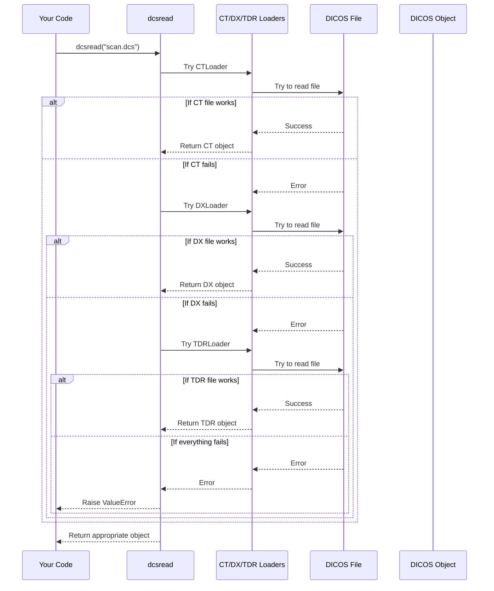

# Chapter 2: DICOS I/O Functions

In [Chapter 1: DICOS Data Types (CT, DX, TDR)](01_dicos_data_types__ct__dx__tdr__.md), we learned about the different types of security scanning data that pyDICOS helps us manage. Now, let's explore how to easily read and write these DICOS files without worrying about their specific types.

## The Problem: Working with Different File Types

Imagine you're working at an airport where different scanning machines produce various file types. Some produce CT scans, others X-ray images, and you also receive threat detection reports. Without pyDICOS, you'd need to:

1. Figure out what type of file you're dealing with
2. Choose the correct loader for that file type
3. Use that specific loader to open the file

That's a lot of work just to open a file! This is where pyDICOS I/O functions come to the rescue.

## Universal File Handlers: `dcsread` and `dcswrite`

pyDICOS provides two simple functions that handle all the complexity for you:

- **`dcsread`**: Reads any DICOS file and automatically figures out its type
- **`dcswrite`**: Saves any DICOS object to disk

Think of these as your "universal remote controls" for DICOS files - one tool that works with all types.

## Reading DICOS Files with `dcsread`

The `dcsread` function is like a smart assistant that:
1. Examines a file
2. Determines if it's CT, DX, or TDR
3. Uses the appropriate loader
4. Returns the loaded object

Here's a simple example:

```python
from pyDICOS import dcsread
import matplotlib.pyplot as plt

# Let dcsread figure out the file type automatically
scan = dcsread("security_scan.dcs")

# Check what type of scan we got
if hasattr(scan, 'get_volume_data'):
    # It's a CT scan
    volume = scan.get_volume_data()
    plt.imshow(volume[0][50], cmap='gray')  # Show slice 50
    plt.title("CT Slice")
elif hasattr(scan, 'get_image_data'):
    # It's a DX (X-ray) scan
    image = scan.get_image_data()
    plt.imshow(image, cmap='gray')
    plt.title("X-ray Image")
else:
    # It's a TDR (threat report)
    print("Detected threats:", len(scan.get_data()["PTOs"]))

plt.show()
```

In this example, we didn't need to know what type of file we were opening beforehand. The `dcsread` function figured it out and returned the appropriate object, which we could then work with.

## Writing DICOS Files with `dcswrite`

Saving DICOS objects is just as easy with `dcswrite`. No matter what type of DICOS object you have, this function saves it to disk:

```python
from pyDICOS import dcsread, dcswrite
import numpy as np

# Read an existing CT scan
ct_scan = dcsread("baggage_scan.ct")

# Modify some data (for example, adding a filter)
volume_data = ct_scan.get_volume_data()
filtered_data = np.clip(volume_data * 1.2, 0, 65535)  # Brighten and clip
ct_scan.set_volume_data(filtered_data)

# Save the modified scan
dcswrite(ct_scan, "enhanced_baggage_scan.ct")
print("Modified scan saved successfully!")
```

In this example, we:
1. Read a CT scan
2. Applied a simple brightness adjustment
3. Saved it to a new file using `dcswrite`

## A Complete Example: Processing Different File Types

Let's see a more practical example where we need to process a folder of different DICOS files:

```python
from pyDICOS import dcsread, dcswrite
import os
import matplotlib.pyplot as plt

# Process all DICOS files in a directory
scan_directory = "security_scans/"

for filename in os.listdir(scan_directory):
    if filename.endswith((".ct", ".dx", ".tdr")):
        file_path = os.path.join(scan_directory, filename)
        
        try:
            # Let dcsread handle the file type automatically
            scan = dcsread(file_path)
            
            # Create a filename for the processed output
            output_path = os.path.join(scan_directory, "processed_" + filename)
            
            # Process based on type (simplified example)
            if hasattr(scan, 'get_volume_data'):
                print(f"Processing CT scan: {filename}")
                # Save with a different filename
                dcswrite(scan, output_path)
                
            elif hasattr(scan, 'get_image_data'):
                print(f"Processing X-ray image: {filename}")
                # Save with a different filename
                dcswrite(scan, output_path)
                
            else:
                print(f"Found threat report: {filename}")
                # Just copy the TDR file
                dcswrite(scan, output_path)
                
        except Exception as e:
            print(f"Error processing {filename}: {e}")
```

This script processes a whole directory of different DICOS files, and we never have to worry about their specific types!

## Under the Hood: How DICOS I/O Functions Work

Let's peek behind the curtain to understand how these functions work:



When you call `dcsread`, it tries each loader (CT, DX, TDR) one after another until one succeeds. It's like trying different keys until one unlocks the door. 

If we look at the actual implementation in `pydicos/_dicosio.py`:

```python
def dcsread(
    filename: Union[str, Path],
    dcs: Optional[Union[CTLoader, DXLoader, TDRLoader]] = None
) -> Union[CTLoader, DXLoader, TDRLoader]:
    """Read a DICOS file."""
    if dcs is not None:
        dcs.read(str(filename))
        return dcs

    for DCSLoader in [CTLoader, DXLoader, TDRLoader]:
        try:
            dcs_loader = DCSLoader()
            dcs_loader.read(str(filename))
            return dcs_loader
        except:
            logging.debug(f"Loading failed with {DCSLoader}")
            pass

    raise ValueError(f"Invalid DICOS file: {filename}")
```

You can see the function:
1. First checks if you provided a specific loader (`dcs` parameter)
2. If not, it tries each loader in sequence (CT, DX, TDR)
3. Returns the first one that works
4. If all fail, it raises an error

Similarly, `dcswrite` is straightforward - it just calls the `write` method on whichever DICOS object you give it:

```python
def dcswrite(dcs: Union[CTLoader, DXLoader, TDRLoader], filename: Union[str, Path]):
    """Write a DICOS file."""
    dcs.write(str(filename))
```

## Advanced Usage: Pre-specifying the File Type

Sometimes you already know what type of file you're working with. In these cases, you can provide a pre-created loader to `dcsread`:

```python
from pyDICOS import dcsread, CTLoader

# Create a CT loader specifically
ct_loader = CTLoader()

# Use it with dcsread (this skips trying the other loaders)
scan = dcsread("baggage_scan.ct", dcs=ct_loader)

# Now work with the CT data
volume = scan.get_volume_data()
```

This approach is slightly more efficient since `dcsread` doesn't have to try different loaders, but it's only useful when you're certain about the file type.

## Common Pitfalls and Solutions

### Handling Unsupported Files

Sometimes you might try to read a file that isn't a valid DICOS file. Let's handle this gracefully:

```python
from pyDICOS import dcsread
import os

def safe_read_dicos(filepath):
    try:
        return dcsread(filepath)
    except ValueError as e:
        print(f"Error: {filepath} is not a valid DICOS file")
        return None
    except Exception as e:
        print(f"Unexpected error reading {filepath}: {e}")
        return None

# Example usage
scans_folder = "mixed_files/"
for filename in os.listdir(scans_folder):
    filepath = os.path.join(scans_folder, filename)
    scan = safe_read_dicos(filepath)
    if scan:
        print(f"Successfully loaded {filename}")
        # Process the scan...
```

This wrapper function gives you a safe way to try reading files that might not be valid DICOS files.

## Summary

In this chapter, we learned about pyDICOS I/O functions:

- `dcsread`: A universal function that automatically detects and reads any DICOS file type
- `dcswrite`: A simple function to save any DICOS object to disk

These functions hide all the complexity of working with different DICOS file formats, allowing you to focus on your actual work rather than file handling details.

In the next chapter, [Network Communication](03_network_communication_.md), we'll explore how pyDICOS helps you transmit DICOS data over networks, which is essential for integrated security screening systems where machines need to share scan information.

---

Generated by [AI Codebase Knowledge Builder](https://github.com/The-Pocket/Tutorial-Codebase-Knowledge)