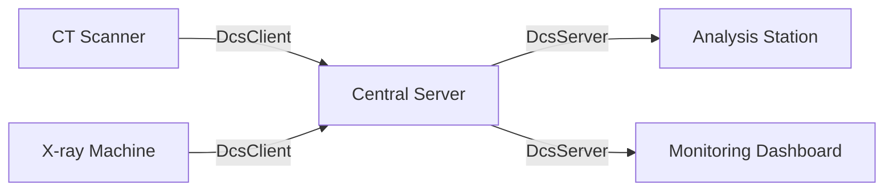
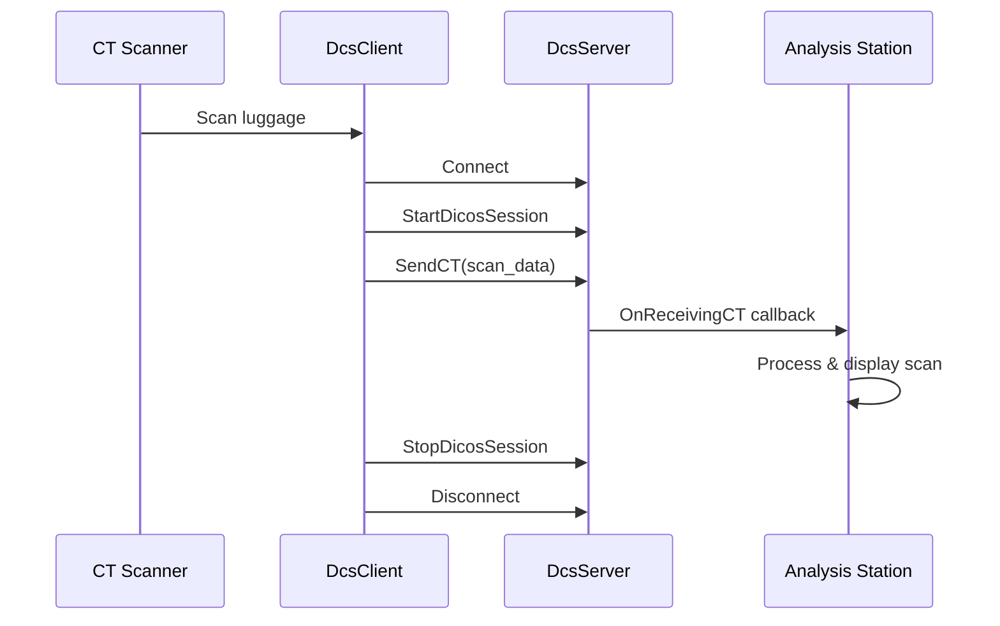
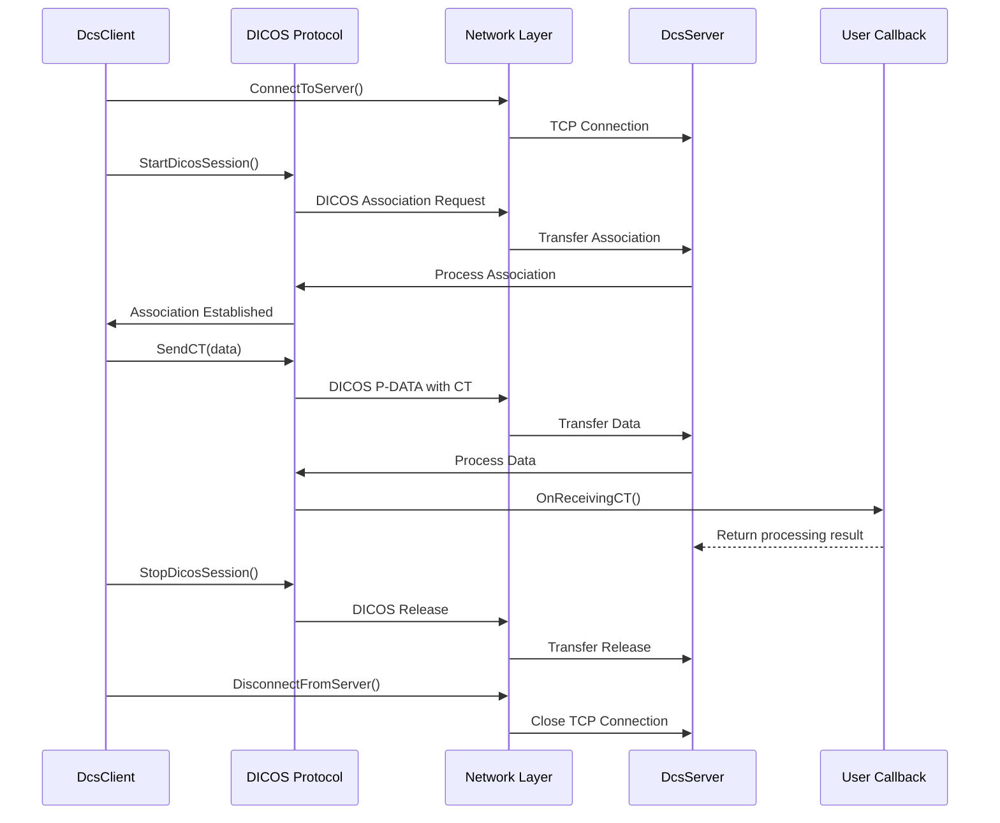

# Chapter 3: Network Communication

In [Chapter 2: DICOS I/O Functions](02_dicos_i_o_functions_.md), we learned how to read and write DICOS files locally. But what if our security scanning systems are distributed across different locations and need to share data in real-time? This is where network communication comes in!

## Real-World Problem: Sharing Security Scan Data

Imagine a busy airport security checkpoint:

1. A CT scanner examines luggage at one station
2. A remote analyst needs to review suspicious items immediately
3. An automated threat detection system on a separate computer needs the data
4. Multiple checkpoints need to share data with a central monitoring station

Without network capabilities, you'd need to manually transfer files between systems - a slow, error-prone process. pyDICOS solves this with its network communication classes.

## Client-Server Architecture for Security Imaging

pyDICOS uses a client-server model for network communication, similar to how web applications work:



The two main components are:

1. **DcsClient**: Sends DICOS data (like CT scans or X-rays) to a server
2. **DcsServer**: Receives DICOS data from clients

Think of it like a phone call - the client "calls" the server, and once connected, they can exchange data.

## Sending Data with DcsClient

The `DcsClient` class handles:
- Connecting to a server
- Setting up communication parameters
- Sending DICOS data over the network

Let's look at a simple example where we send a CT scan to a server:

```python
from pydicos import CTLoader, dcsread, DcsClient

# Set up the client
client = DcsClient()
client.SetServerPortandIP(9999, "192.168.1.100")  # Server IP and port
client.SetSourceApplication("CT_SCANNER_1")       # Identify ourselves
client.SetDestinationApplication("CENTRAL_SERVER") # Who we're sending to

# Load a CT scan from a file
ct_scan = dcsread("luggage_scan.ct")

# Connect and send the data
if client.ConnectToServer():
    if client.StartDicosSession(client.SOPCLASSUID.enumSopCT):
        # Send the CT scan
        success = client.SendCT(ct_scan)
        if success:
            print("Scan sent successfully!")
        else:
            print("Failed to send scan:", client.GetErrorLog())
        client.StopDicosSession()
    client.DisconnectFromServer()
```

This code initializes a client, connects to a server at IP address 192.168.1.100 on port 9999, and sends a CT scan. The process is similar to making a phone call - dial the number, have a conversation, then hang up.

## Setting Up Communication Parameters

Before sending data, you can configure various parameters:

```python
# Set communication timeouts
client.SetReadTimeoutInMilliseconds(5000)  # Wait up to 5 seconds for server response
client.SetWriteTimeoutInMilliseconds(8000) # Wait up to 8 seconds when sending data

# Enable encryption for security
error_log = ""
client.SetSslCertificate("certificate.pfx", "password123", "ServerName", error_log)
client.EnableSsl(True)

# Enable data compression to save bandwidth
client.PrioritizeDataCompression(True)
```

These settings help optimize the connection based on your network conditions and security requirements.

## Receiving Data with DcsServer

The `DcsServer` class handles:
- Listening for incoming connections
- Accepting client connections
- Receiving DICOS data

Let's create a simple server that receives CT scans:

```python
from pydicos import DcsServer

# Create a callback to handle received data
class ScanReceiver:
    def OnReceivingCT(self, ct_data, client_ip):
        print(f"Received CT scan from {client_ip}")
        # Process the CT scan data
        volume = ct_data.get_volume_data()
        print(f"Volume dimensions: {volume.shape}")
        # Save the data locally
        ct_data.write(f"received_scan_from_{client_ip}.ct")
        return True

# Set up the server
server = DcsServer()
server.SetPort(9999)
server.SetIP("0.0.0.0")  # Listen on all network interfaces
server.SetApplicationName("CENTRAL_SERVER")

# Configure which DICOS types to accept
server.IncludeSopClassUID(server.SOPCLASSUID.enumSopCT)

# Start listening for connections
callback = ScanReceiver()
server.StartListening(callback)

# Keep the server running (in a real app, you might have a better way to do this)
try:
    print("Server is listening... Press Ctrl+C to stop")
    while True:
        pass
except KeyboardInterrupt:
    server.StopListening()
    print("Server stopped")
```

This code sets up a server that listens on port 9999 and accepts CT scan data. The `ScanReceiver` class defines what happens when data is received - in this case, we print some information and save the scan as a file.

## A Complete Example: Airport Security Network

Let's put everything together in a more realistic example:



Here's how to implement a client at a CT scanner:

```python
from pydicos import CTLoader, DcsClient
import time

class SecurityScanner:
    def __init__(self, server_ip, server_port):
        self.client = DcsClient()
        self.client.SetServerPortandIP(server_port, server_ip)
        self.client.SetSourceApplication("SCANNER_1")
        self.client.SetDestinationApplication("SECURITY_CENTER")
        
    def scan_and_send(self, luggage_id):
        # Simulate scanning (in a real system, this would interface with hardware)
        print(f"Scanning luggage {luggage_id}...")
        time.sleep(2)  # Simulate scan time
        
        # Create a CT scan (simplified for example)
        ct_scan = CTLoader()
        # ... populate ct_scan with real data ...
        
        # Send to server
        if self.client.ConnectToServer():
            print("Connected to security center")
            if self.client.StartDicosSession(self.client.SOPCLASSUID.enumSopCT):
                if self.client.SendCT(ct_scan):
                    print(f"Luggage {luggage_id} scan sent successfully")
                else:
                    print("Failed to send scan:", self.client.GetErrorLog())
                self.client.StopDicosSession()
            self.client.DisconnectFromServer()
```

And here's the server at the security center:

```python
from pydicos import DcsServer
import threading

class SecurityCenter:
    def __init__(self, port=9999):
        self.server = DcsServer()
        self.server.SetPort(port)
        self.server.SetIP("0.0.0.0")  # Listen on all interfaces
        self.server.SetApplicationName("SECURITY_CENTER")
        
        # Accept CT scans and threat reports
        self.server.IncludeSopClassUID(self.server.SOPCLASSUID.enumSopCT)
        self.server.IncludeSopClassUID(self.server.SOPCLASSUID.enumSopTDR)
        
    def start(self):
        # Create and set callback
        callback = SecurityCenterCallback()
        self.server.StartListening(callback)
        print("Security center server started")
        
    def stop(self):
        self.server.StopListening()
        print("Security center server stopped")

class SecurityCenterCallback:
    def OnReceivingCT(self, ct_data, client_ip):
        print(f"Received CT scan from scanner at {client_ip}")
        # Start threat analysis in a separate thread
        threading.Thread(target=self.analyze_scan, args=(ct_data, client_ip)).start()
        return True
        
    def analyze_scan(self, ct_data, source_ip):
        print(f"Analyzing scan from {source_ip}...")
        # ... perform threat detection ...
        print("Analysis complete")
```

This example shows a more complete airport security system where:
1. CT scanners send scan data to a central security center
2. The security center processes incoming scans for threat detection
3. Multiple scanners can connect simultaneously

## Under the Hood: How Network Communication Works

Let's look at what happens behind the scenes when a client sends data to a server:



The pyDICOS network classes use the DICOS protocol (the medical imaging standard that DICOS is based on) for communication. This provides a reliable, standardized way to transfer complex imaging data.

When you call `ConnectToServer()`, a TCP connection is established. The `StartDicosSession()` initiates a DICOS association, specifying which types of data will be transferred. The actual data transfer happens with methods like `SendCT()`, which package the data according to the DICOS protocol before sending it over the network.

## Security Considerations

Security is crucial when transmitting sensitive screening data. pydicos supports SSL/TLS encryption:

```python
# On the client
client = DcsClient()
error_log = ""
client.SetSslCertificate("client_cert.pfx", "password", "ClientName", error_log)
client.EnableSsl(True)

# On the server
server = DcsServer()
server.SetSslCertificate("server_cert.pfx", "password", "ServerName", error_log)
server.SetTLSClientCertificateRequired(True)  # Require clients to authenticate
```

This ensures that all data is encrypted during transmission, protecting it from eavesdropping.

## Implementation Details

The network classes in pydicos are C++ wrappers around the DICOS networking protocol. The Python bindings provide a simple interface to this complex functionality:

- `DcsClient` maps to `Network::DcsClient` in C++
- `DcsServer` maps to `Network::DcsServer` in C++

The `export_DCSCLIENT` and `export_DCSSERVER` functions in the C++ code create the Python bindings, exposing methods like `ConnectToServer()` and `StartListening()` to Python code.

For example, when you call `client.SendCT(ct_data)` in Python, the following happens:
1. The Python wrapper converts the `ct_data` object to its C++ representation
2. The C++ `SendCT` method is called with this data
3. The C++ code handles the DICOS protocol details and network transmission
4. The result is returned back to Python

This approach gives you the ease of use of Python with the performance of C++ for handling the complex protocols and large data transfers.

## Common Pitfalls and Solutions

### Connection Timeouts

If your connections are timing out, adjust the timeout settings:

```python
# Increase timeouts for slow or unstable networks
client.SetReadTimeoutInMilliseconds(10000)   # 10 seconds
client.SetWriteTimeoutInMilliseconds(15000)  # 15 seconds
```

### Handling Large Data Transfers

When sending large CT volumes, enable compression to reduce transfer time:

```python
# Enable compression for large data transfers
client.PrioritizeDataCompression(True)
```

### Checking Connection Status

Always check if operations succeeded:

```python
if not client.ConnectToServer():
    print("Connection failed:", client.GetErrorLog())
    # Handle connection failure
```

## Summary

In this chapter, we've learned how to use pyDICOS for network communication:

- The client-server architecture for security imaging data
- Using `DcsClient` to send DICOS data to a server
- Setting up `DcsServer` to receive data from clients
- Configuring security and performance parameters
- Building a complete airport security scanning network

These capabilities enable real-time transmission of security scan data between different systems, allowing for integrated security screening where scanners, analysis stations, and monitoring systems can work together seamlessly.

In the next chapter, [Multidimensional Data Structures](04_multidimensional_data_structures_.md), we'll explore how pyDICOS handles complex data like 3D volumes, which is essential for working with the data we've learned to transmit over the network.

---

Generated by [AI Codebase Knowledge Builder](https://github.com/The-Pocket/Tutorial-Codebase-Knowledge)