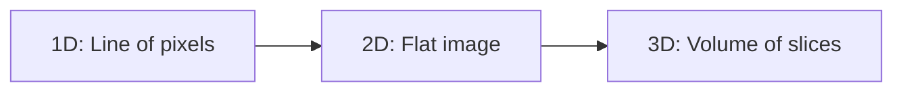
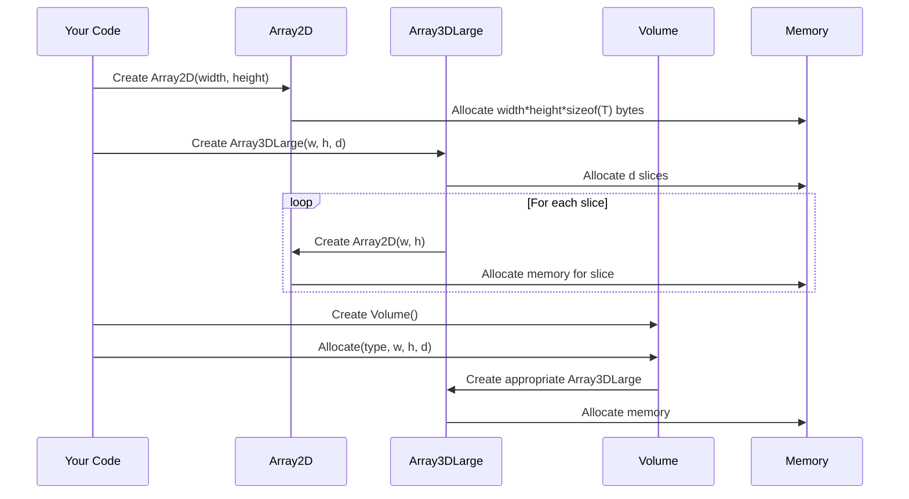

# Chapter 4: Multidimensional Data Structures

In [Chapter 3: Network Communication](03_network_communication_.md), we learned how to share DICOS data between different systems. Now, let's dive into how pyDICOS actually represents and stores that data internally.

## Why Special Data Structures?

Imagine you're working with security scan images. You might have:

- 2D X-ray images (like a flat photograph)
- 3D CT scans (like a stack of many thin slices showing the inside of a bag)

You could use regular Python lists or NumPy arrays to store this data, but security imaging has unique requirements:

- Very large datasets (CT scans can be gigabytes)
- Special memory handling for efficient processing
- Integration with security-specific algorithms

That's why pyDICOS provides specialized data structures designed specifically for security imaging data.

## Basic Concept: Dimensions in Imaging

Let's understand dimensions in imaging with a simple analogy:

- **1D data** is like a line of pixels (rarely used alone)
- **2D data** is like a photograph (width × height)
- **3D data** is like a CT scan (width × height × depth)



In security imaging, we mostly work with 2D and 3D data. Let's explore the classes pyDICOS provides for each.

## Array2D: Working with Flat Images

`Array2D` represents two-dimensional data - perfect for X-ray images or individual slices of a CT scan.

Think of `Array2D` as a grid of pixels, where each pixel has a value representing its intensity (how bright it is).

### Creating and Using Array2D

Here's a simple example of creating and working with an `Array2D`:

```python
from pyDICOS import Array2DUInt16  # For 16-bit unsigned integers
import matplotlib.pyplot as plt

# Create a new 2D array (width=100, height=80)
image = Array2DUInt16(100, 80)

# Set some pixel values
for x in range(40, 60):
    for y in range(30, 50):
        image.Set(x, y, 65000)  # Set to a bright value

# Display the image
plt.imshow(image, cmap='gray')
plt.title("Simple 2D Array")
plt.show()
```

This code creates a 100×80 pixel image and sets a 20×20 square in the middle to a bright value. The rest of the image remains black (value 0).

### Accessing Pixel Values

You can access or modify individual pixels using the `Get` and `Set` methods:

```python
# Get a pixel value
pixel_value = image.Get(50, 40)
print(f"Pixel value at (50,40): {pixel_value}")

# Set a pixel value
image.Set(50, 40, 32000)  # Set to half brightness
```

You can also access the raw buffer directly, which is useful for faster operations:

```python
# Get the raw buffer (pointer to the data)
buffer = image.GetBuffer()

# Get the dimensions
width = image.GetWidth()
height = image.GetHeight()

print(f"Image dimensions: {width}×{height}")
```

## Array3DLarge: Working with Volumetric Data

When you have 3D data like a CT scan, you need `Array3DLarge`. It represents a 3D volume as a stack of 2D slices.

### Creating and Using Array3DLarge

Here's how to create and work with a 3D volume:

```python
from pyDICOS import Array3DLargeUInt16, VOLUME_MEMORY_POLICY
import numpy as np

# Create a volume (width=100, height=80, depth=50)
volume = Array3DLargeUInt16(100, 80, 50, VOLUME_MEMORY_POLICY.OWNS_SLICES)

# Access a specific slice (2D array)
slice_10 = volume[10]  # Get the 10th slice

# Set values in a specific region of the volume
for z in range(20, 30):
    slice_z = volume[z]
    for x in range(40, 60):
        for y in range(30, 50):
            slice_z.Set(x, y, 65000)  # Create a bright cube
```

This creates a 3D volume and fills a 20×20×10 cube inside it with a bright value.

The `OWNS_SLICES` policy means that the `Array3DLarge` object is responsible for managing the memory of each slice. This is important because 3D data can be very large.

### Working with Slices

A key feature of `Array3DLarge` is that you can work with individual 2D slices:

```python
# Get a specific slice
slice_25 = volume[25]

# Work with the slice like any Array2D
middle_value = slice_25.Get(50, 40)
print(f"Value at position (50,40,25): {middle_value}")

# Modify the slice
slice_25.Set(50, 40, 30000)
```

This is very useful for processing CT scans, where you might want to analyze or modify one slice at a time.

## Volume: Higher-Level Functionality

While `Array3DLarge` provides basic 3D data storage, the `Volume` class offers higher-level functionality for working with volumetric imaging data:

- Handles different data types automatically
- Provides iterators for efficiently processing slices
- Manages memory more flexibly

### Creating and Using Volume

Here's a basic example:

```python
from pyDICOS import Volume, IMAGE_DATA_TYPE
import numpy as np

# Create a Volume with 16-bit unsigned integer data
vol = Volume()
vol.Allocate(IMAGE_DATA_TYPE.enumUnsigned16Bit, 100, 80, 50)

# Set data from a NumPy array
data = np.zeros((50, 80, 100), dtype=np.uint16)
data[20:30, 30:50, 40:60] = 65000  # Create a bright cube
Volume.set_data(vol, data)

# Get dimensions
print(f"Volume dimensions: {vol.GetWidth()}×{vol.GetHeight()}×{vol.GetDepth()}")
```

This code creates a Volume object and fills it with data from a NumPy array. The `set_data` method is a convenient way to transfer data between NumPy (which you might use for processing) and pyDICOS.

### Iterating Through Slices

One powerful feature of the `Volume` class is its ability to iterate through slices:

```python
# Create an iterator for processing all slices
slice_iter = vol.Begin()

# Process each slice
while slice_iter != vol.End():
    # Get the current slice as a 16-bit unsigned array
    current_slice = slice_iter.AsUnsigned16()
    
    # Do something with the slice
    avg_value = np.mean(current_slice)
    print(f"Slice {slice_iter.GetCurrentSlice()} average: {avg_value}")
    
    # Move to the next slice
    slice_iter = slice_iter + 1
```

This makes it easy to process an entire volume slice by slice, which is often more memory-efficient than working with the whole volume at once.

## Converting Between NumPy and pyDICOS

Since many data processing libraries in Python use NumPy arrays, pyDICOS makes it easy to convert between its specialized data structures and NumPy:

```python
import numpy as np
from pyDICOS import Array2DUInt16, Volume

# Convert an Array2D to NumPy
image = Array2DUInt16(100, 80)
# ... set some values ...
numpy_image = np.array(image)  # Automatic conversion

# Convert a Volume to NumPy
vol = Volume()
vol.Allocate(IMAGE_DATA_TYPE.enumUnsigned16Bit, 100, 80, 50)
# ... set some values ...

# Get the data as a NumPy array
numpy_volume = None
if vol.GetUnsigned16() is not None:
    array3d = vol.GetUnsigned16()
    numpy_volume = np.array(array3d)

print(f"NumPy volume shape: {numpy_volume.shape}")
```

This interoperability makes it easy to use pyDICOS with other Python libraries for image processing, machine learning, or visualization.

## Under the Hood: How the Data Structures Work

Let's look at what happens when you create and use these data structures:



When you create an `Array2D`, it allocates a contiguous block of memory to store all the pixel values in row-major order (rows are stored one after another in memory).

`Array3DLarge` doesn't store all its data in one contiguous block. Instead, it manages an array of `Array2D` objects (slices). This design allows for more flexible memory management, especially with large datasets.

`Volume` adds another layer that handles different data types. Based on the data type you specify (like unsigned 16-bit), it creates and manages the appropriate `Array3DLarge` object internally.

## Memory Considerations

Security imaging data can be very large. A typical CT scan might be 512×512×600 voxels with 16 bits per voxel, which is over 300MB! That's why memory management is critical.

The `Array3DLarge` class offers different memory policies:

```python
from pyDICOS import Array3DLargeUInt16, VOLUME_MEMORY_POLICY

# Create a volume that owns its slices (default)
volume1 = Array3DLargeUInt16(100, 80, 50, VOLUME_MEMORY_POLICY.OWNS_SLICES)

# Create a volume that doesn't own its slices
# (useful for referencing data that exists elsewhere)
volume2 = Array3DLargeUInt16(100, 80, 50, VOLUME_MEMORY_POLICY.BORROWS_SLICES)
```

- `OWNS_SLICES`: The `Array3DLarge` is responsible for allocating and freeing memory for each slice.
- `BORROWS_SLICES`: The `Array3DLarge` references slices allocated elsewhere, without taking ownership.

This flexibility is crucial for complex systems where memory efficiency matters.

## Practical Examples

### Example 1: Processing a CT Scan Slice by Slice

Here's how you might process a CT scan using pyDICOS data structures:

```python
from pyDICOS import dcsread, Volume
import numpy as np
import matplotlib.pyplot as plt

# Read a CT scan
ct_scan = dcsread("baggage_scan.ct")

# Get the volume data
volume = ct_scan.get_volume_data()

# Process each slice
for z in range(volume.shape[0]):
    # Get the slice
    slice_z = volume[z]
    
    # Simple processing: thresholding
    threshold = 1000
    binary_slice = (slice_z > threshold).astype(np.uint8) * 255
    
    # Save or display the processed slice
    plt.imsave(f"processed_slice_{z}.png", binary_slice, cmap='gray')
    
    # Just process first 5 slices for this example
    if z >= 4:
        break
```

This example reads a CT scan, extracts the volume data, and processes each slice by applying a threshold to create a binary image.

### Example 2: Creating a 3D Visualization

```python
from pyDICOS import dcsread
import numpy as np
import matplotlib.pyplot as plt
from mpl_toolkits.mplot3d import Axes3D

# Read a CT scan
ct_scan = dcsread("baggage_scan.ct")

# Get the volume data
volume = ct_scan.get_volume_data()

# Create a 3D visualization (simplified)
# Extract points above a threshold
threshold = 1000
x, y, z = np.where(volume > threshold)

# Downsample for faster rendering
sample_rate = 50
x = x[::sample_rate]
y = y[::sample_rate]
z = z[::sample_rate]

# Plot the points
fig = plt.figure(figsize=(10, 8))
ax = fig.add_subplot(111, projection='3d')
ax.scatter(x, y, z, c='red', marker='.')
plt.title("3D Visualization of CT Scan")
plt.show()
```

This example creates a simple 3D visualization of a CT scan by extracting points above a threshold and plotting them in 3D space.

## Summary

In this chapter, we've explored the multidimensional data structures in pyDICOS:

- `Array2D` for working with 2D images
- `Array3DLarge` for handling 3D volumetric data
- `Volume` for higher-level functionality with different data types

These specialized structures are optimized for security imaging data, making it efficient to:
- Store large datasets
- Process individual slices of 3D volumes
- Convert between pyDICOS and NumPy for compatibility with other libraries

We've seen how to create, access, and modify these data structures, as well as how they manage memory behind the scenes.

In the next chapter, [Geometry Representation](05_geometry_representation_.md), we'll learn how pyDICOS represents the physical geometry of scans, which is essential for mapping the pixel/voxel data to real-world locations.

---

Generated by [AI Codebase Knowledge Builder](https://github.com/The-Pocket/Tutorial-Codebase-Knowledge)