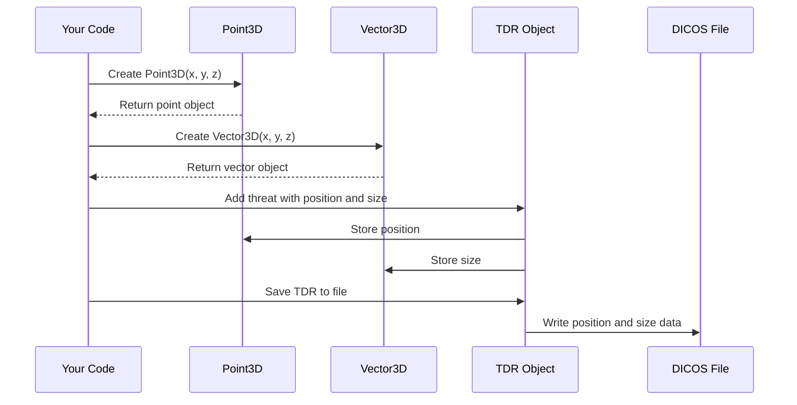
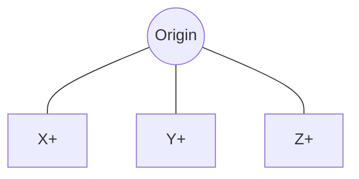

# Chapter 5: Geometry Representation

In [Chapter 4: Multidimensional Data Structures](04_multidimensional_data_structures_.md), we learned how pyDICOS stores image and volumetric data. Now, we'll explore how to represent locations and directions in 3D space, which is essential for identifying exactly where objects are located within our scans.

## Why Do We Need Geometry Representation?

Imagine you're analyzing a CT scan of a suitcase and you spot something suspicious - maybe what looks like a prohibited item. How would you tell someone else exactly where to look? You might say something like:

"There's a suspicious object about 10cm from the left side, 15cm from the bottom, and 20cm deep into the bag."

This is precisely what geometry representation helps us do in code. It gives us a structured way to mark locations and define regions in 3D space.

## Key Geometry Classes in pyDICOS

pyDICOS provides two main classes for geometry representation:

1. **Point3D**: Represents a specific location in 3D space (x, y, z coordinates)
2. **Vector3D**: Represents direction and magnitude in 3D space

Think of **Point3D** as a pushpin marking a specific spot, while **Vector3D** is like an arrow showing direction and distance.

## Working with Point3D

`Point3D` is the simplest way to mark a specific location in a 3D scan. It stores three coordinates: x, y, and z.

### Creating and Using Point3D

Let's start with a basic example:

```python
from pydicos import Point3DFloat

# Create a point at coordinates (10.5, 20.0, 30.5)
point = Point3DFloat(10.5, 20.0, 30.5)

# Access individual coordinates
x_coord = point.x
y_coord = point.y
z_coord = point.z
print(f"Point coordinates: ({x_coord}, {y_coord}, {z_coord})")

# Change the coordinates
point.x = 15.0
point.Set(15.0, 25.0, 35.0)  # Another way to set all coordinates at once
```

In this example, we created a `Point3DFloat` (a point with floating-point coordinates) at position (10.5, 20.0, 30.5). We can access each coordinate directly or update them either individually or all at once using the `Set` method.

### Different Types of Points

pyDICOS provides different versions of Point3D depending on the data type you need:

- `Point3DFloat`: For floating-point coordinates (most common)
- `Point3DInt`: For integer coordinates
- `Point3DDouble`: For high-precision floating-point coordinates

Choose the appropriate type based on your application's requirements. For most security scanning applications, `Point3DFloat` provides a good balance between precision and memory usage.

### Comparing Points

You can check if two points are at the same location:

```python
# Create two points
point1 = Point3DFloat(10.0, 20.0, 30.0)
point2 = Point3DFloat(10.0, 20.0, 30.0)
point3 = Point3DFloat(15.0, 25.0, 35.0)

# Compare points
if point1 == point2:
    print("point1 and point2 are at the same location")
else:
    print("point1 and point2 are at different locations")

if point1 != point3:
    print("point1 and point3 are at different locations")
```

This code shows how to compare points for equality. Two points are considered equal if all their coordinates (x, y, and z) match exactly.

## Working with Vector3D

While `Point3D` represents a location, `Vector3D` represents direction and magnitude - like an arrow pointing from one place to another.

### Creating and Using Vector3D

Here's a basic example:

```python
from pydicos import Vector3DFloat, Point3DFloat

# Create a vector directly with coordinates
vector1 = Vector3DFloat(5.0, 10.0, 15.0)

# Create a vector from a point
point = Point3DFloat(5.0, 10.0, 15.0)
vector2 = Vector3DFloat(point)

# Access and modify vector components
print(f"Vector components: ({vector1.x}, {vector1.y}, {vector1.z})")
vector1.Set(7.5, 12.5, 17.5)  # Change all components at once
```

This example demonstrates creating vectors either directly or from a point. Like with `Point3D`, you can access and modify the vector components.

### Vectors for Representing Dimensions

Vectors are particularly useful for representing the size or extent of objects:

```python
from pydicos import Point3DFloat, Vector3DFloat

# Define the center position of a suspicious object
object_center = Point3DFloat(150.0, 200.0, 75.0)

# Define the dimensions of the object
object_dimensions = Vector3DFloat(30.0, 25.0, 15.0)

# Calculate the corners of the bounding box
min_corner = Point3DFloat(
    object_center.x - object_dimensions.x/2,
    object_center.y - object_dimensions.y/2,
    object_center.z - object_dimensions.z/2
)

max_corner = Point3DFloat(
    object_center.x + object_dimensions.x/2,
    object_center.y + object_dimensions.y/2,
    object_center.z + object_dimensions.z/2
)
```

In this example, we defined the center position of an object using a `Point3DFloat` and its dimensions using a `Vector3DFloat`. We then calculated the minimum and maximum corners of a bounding box that encloses the object.

## Practical Example: Marking a Potential Threat

Let's put everything together in a real-world example: marking a potential threat in a CT scan.

```python
from pydicos import CTLoader, TDRLoader, Point3DFloat, Vector3DFloat

# Load a CT scan
ct_scan = CTLoader("baggage_scan.ct")

# Create a new TDR (Threat Detection Report)
tdr = TDRLoader()

# Define threat location and size
threat_position = Point3DFloat(150.0, 200.0, 75.0)
threat_size = Vector3DFloat(30.0, 25.0, 15.0)

# Create threat data
threat_data = {
    "InstanceNumber": 1,
    "AlarmDecision": 1,  # 1 = Alarm
    "PTOs": [{
        "ID": 1,
        "Base": {"x": threat_position.x, "y": threat_position.y, "z": threat_position.z},
        "Extent": {"x": threat_size.x, "y": threat_size.y, "z": threat_size.z},
        "Assessment": {
            "flag": 2,  # 2 = Threat
            "category": 1,  # 1 = Explosive
            "probability": 0.92
        }
    }]
}

# Add threat data to TDR
tdr.set_data(threat_data)

# Save the TDR file
tdr.write("detected_threat.tdr")
```

In this example, we:
1. Loaded a CT scan
2. Created a new Threat Detection Report
3. Defined the threat's position using a `Point3DFloat`
4. Defined the threat's size using a `Vector3DFloat`
5. Created the threat data with this position and size information
6. Saved the TDR file

This is a common workflow in security screening systems, where automated detection algorithms find suspicious objects and mark their positions in 3D space.

## Visualizing a Marked Threat

To better understand how these geometry classes are used, let's visualize a marked threat in a CT scan:

```python
from pydicos import CTLoader, TDRLoader
import numpy as np
import matplotlib.pyplot as plt

# Load a CT scan and its associated threat report
ct_scan = CTLoader("baggage_scan.ct")
tdr = TDRLoader("detected_threat.tdr")

# Get the volume data
volume = ct_scan.get_volume_data()

# Get threat information
threat_info = tdr.get_data()
threat = threat_info["PTOs"][0]  # Get the first threat

# Extract threat position and size
position = threat["Base"]
size = threat["Extent"]

# Find slice to display (in the middle of the threat)
z_center = int(position["z"])
slice_to_show = volume[z_center]

# Display the slice
plt.figure(figsize=(10, 8))
plt.imshow(slice_to_show, cmap='gray')

# Draw rectangle marking the threat
rect = plt.Rectangle(
    (position["x"] - size["x"]/2, position["y"] - size["y"]/2),
    size["x"], size["y"],
    linewidth=2, edgecolor='r', facecolor='none'
)
plt.gca().add_patch(rect)

plt.title(f"CT Slice with Marked Threat")
plt.show()
```

This code loads a CT scan and its associated threat report, then displays a slice from the CT scan with a red rectangle marking the location of the detected threat.

## Under the Hood: How Geometry Classes Work

When you use geometry classes in pyDICOS, here's what happens behind the scenes:



The geometry classes in pyDICOS are actually C++ classes with Python bindings. This gives you the performance of C++ with the ease of use of Python.

For example, when you create a `Point3DFloat(10.0, 20.0, 30.0)` in Python, here's what happens:

1. The Python wrapper calls the C++ constructor for `Point3D<float>`
2. The C++ code allocates memory for the three float values (x, y, z)
3. The coordinates are stored in this memory
4. The Python wrapper provides access to these values

The implementation is quite straightforward, as we can see from the C++ header files:

For Point3D (simplified):
```cpp
template<typename T>
class Point3D {
public:
    T x, y, z;
    
    Point3D() : x(0), y(0), z(0) {}
    Point3D(T cx, T cy, T cz) : x(cx), y(cy), z(cz) {}
    
    void Set(T cx, T cy, T cz) {
        x = cx;
        y = cy;
        z = cz;
    }
    
    // Comparison operators and other methods...
};
```

For Vector3D (simplified):
```cpp
template<typename T>
class Vector3D : public Point3D<T> {
public:
    // Inherits x, y, z from Point3D
    
    Vector3D(T cx, T cy, T cz) : Point3D<T>(cx, cy, cz) {}
    Vector3D(const Point3D<T>& point) : Point3D<T>(point) {}
    
    // Additional vector operations...
};
```

Notice that `Vector3D` actually inherits from `Point3D`, which makes sense because both classes store x, y, z coordinates. The difference is in how these coordinates are interpreted and the operations available on each class.

## Coordinate Systems in DICOS

One important thing to understand is that DICOS uses a right-handed coordinate system, which is standard in 3D graphics and computer vision. In this system:

- X-axis points to the right
- Y-axis points up
- Z-axis points out of the screen (toward the viewer)



This is important to remember when defining positions and interpreting coordinates within your DICOS applications.

## Summary

In this chapter, we've learned about geometry representation in pyDICOS:

- `Point3D` represents a specific location in 3D space with x, y, z coordinates
- `Vector3D` represents direction and magnitude in 3D space
- These classes are essential for marking regions of interest in security scans, particularly for identifying potential threats
- We can use these classes to precisely define where objects are located within CT scans
- This geometry information can be stored in TDR (Threat Detection Report) files

These geometry classes provide the building blocks for describing the spatial relationships within your security scan data, allowing you to mark, track, and analyze potential threats with precision.

In the next chapter, [Data Processing Callbacks](06_data_processing_callbacks_.md), we'll explore how to process DICOS data efficiently using callback functions, which will allow us to build more advanced data processing pipelines.

---

Generated by [AI Codebase Knowledge Builder](https://github.com/The-Pocket/Tutorial-Codebase-Knowledge)