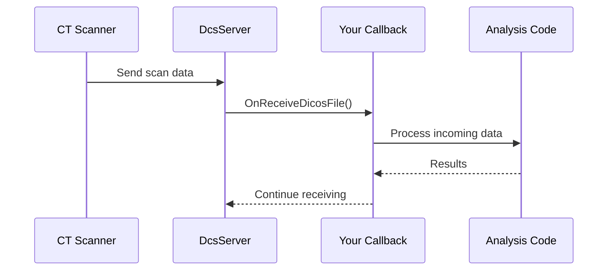
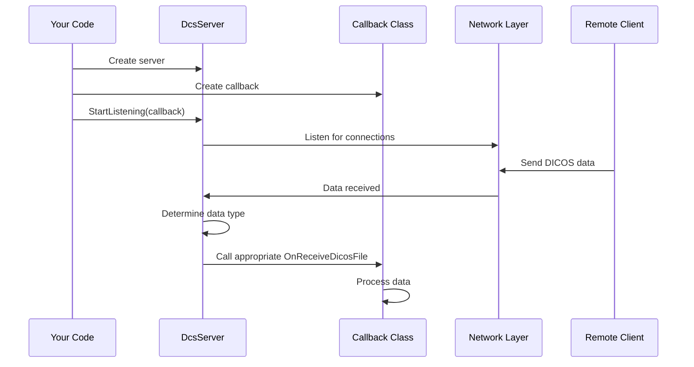

# Chapter 6: Data Processing Callbacks

In [Chapter 5: Geometry Representation](05_geometry_representation_.md), we learned how to represent locations and objects in 3D space. Now, let's explore how pyDICOS helps us process data in real-time as it arrives over a network.

## The Problem: Handling Data as It Arrives

Imagine you work at an airport security checkpoint where multiple baggage scanners continuously send data to a central analysis station. If you waited until an entire scan file was transferred before starting analysis, you might create delays in the security screening process.

Think about watching a YouTube video - you don't have to download the entire video before watching. Instead, it plays while downloading. Similarly, with security screening, we need to process scan data as it arrives.

This is where **Data Processing Callbacks** come in!

## What Are Data Processing Callbacks?

Callbacks are functions that get "called back" (executed) when a specific event happens. If you've ever used a button click handler in a web page, you've used callbacks - code that runs when a specific event (clicking) occurs.

In pyDICOS, callbacks allow you to define what happens when:
- Data starts arriving from a scanner
- Different types of data (CT, DX, TDR) are received
- Errors occur during data transmission
- Network connections are established or closed



## Creating Your First Callback

To process incoming data, you need to create a callback class that inherits from `IReceiveCallback` or one of its subclasses like `DataProcessingMultipleConnections`:

```python
from pyDICOS import DataProcessingMultipleConnections
import numpy as np

class MyDataProcessor(DataProcessingMultipleConnections):
    def __init__(self):
        # Initialize your processor
        super().__init__()
        print("Data processor initialized and ready")
        
    def OnReceiveDicosFile(self, ct_data, errorlog):
        """This method is called when CT data is received"""
        print(f"Receiving CT data from: {ct_data.GetClientIP().Get()}")
        
        # Process the CT data
        ct = None
        ct_data.TakeOwnership(ct)  # Take ownership of the data
        
        if ct:
            # Do something with the CT data
            print(f"Processing scan with dimensions: {ct.get_dimensions()}")
            ct.write("received_scan.ct")  # Save to disk
```

This simple callback prints a message when CT data is received, takes ownership of the data (so it's not destroyed when the function exits), and then saves it to disk.

## Registering Your Callback with a Server

To use your callback, you need to register it with a `DcsServer` (which we learned about in [Chapter 3: Network Communication](03_network_communication_.md)):

```python
from pyDICOS import DcsServer

# Create your callback processor
processor = MyDataProcessor()

# Create a server
server = DcsServer()
server.SetPort(9999)
server.SetIP("0.0.0.0")  # Listen on all interfaces

# Register callback and start listening
server.StartListening(processor)
print("Server started and listening for data...")

# Keep the server running
try:
    input("Press Enter to stop server...\n")
except KeyboardInterrupt:
    pass
finally:
    server.StopListening()
    print("Server stopped")
```

This code creates a server that listens on port 9999 and uses your callback to process any CT data it receives.

## Processing Different Types of DICOS Data

One of the powerful features of pyDICOS callbacks is that they can handle different types of DICOS data automatically. You just need to implement the right methods:

```python
class SecurityAnalyzer(DataProcessingMultipleConnections):
    def OnReceiveDicosFile(self, ct_data, errorlog):
        """Handle CT scans"""
        print("Received CT scan")
        # Process CT data
    
    def OnReceiveDicosFile(self, dx_data, errorlog):
        """Handle X-ray images"""
        print("Received X-ray image")
        # Process DX data
        
    def OnReceiveDicosFile(self, tdr_data, errorlog):
        """Handle threat detection reports"""
        print("Received threat report")
        # Process TDR data
```

The server automatically calls the right method based on the type of data received. This is known as method overloading, where multiple methods with the same name handle different types of input.

## Real-Time Threat Detection Example

Let's build a more practical example: a real-time threat detector that processes CT scans as they arrive and immediately checks for suspicious items:

```python
class RealTimeThreatDetector(DataProcessingMultipleConnections):
    def __init__(self):
        super().__init__()
        self.threat_count = 0
        print("Threat detector initialized")
        
    def OnReceiveDicosFile(self, ct_data, errorlog):
        """Process incoming CT scans for threats"""
        print(f"Analyzing scan from {ct_data.GetClientIP().Get()}")
        
        # Take ownership of the data
        ct = None
        ct_data.TakeOwnership(ct)
        
        if not ct:
            print("Error: Could not take ownership of CT data")
            return
            
        # Get the volume data for analysis
        volume = ct.get_volume_data()
        
        # Simple "threat detection" - just an example
        # (a real detector would be much more sophisticated)
        suspicious_areas = self._detect_suspicious_areas(volume)
        
        if suspicious_areas:
            self.threat_count += 1
            print(f"ALERT: Suspicious item detected! ({self.threat_count} total)")
            self._generate_threat_report(ct, suspicious_areas)
        else:
            print("No threats detected in this scan")
            
    def _detect_suspicious_areas(self, volume):
        """Simple example detection algorithm"""
        # Let's say high-density areas (above 3000) are suspicious
        # This is greatly simplified - real detection is much more complex
        threshold = 3000
        suspicious = np.where(volume > threshold)
        
        if len(suspicious[0]) > 100:  # If we have enough suspicious voxels
            return suspicious
        return None
        
    def _generate_threat_report(self, ct, suspicious_areas):
        """Generate a TDR report for the suspicious area"""
        # Code to create and save a TDR report
        # (simplified for this example)
```

This callback analyzes each CT scan as it arrives, looking for high-density areas (a very simplistic way to detect suspicious items). If it finds any, it generates an alert and creates a threat report.

## Error Handling in Callbacks

Properly handling errors in callbacks is crucial for robust applications:

```python
class RobustProcessor(DataProcessingMultipleConnections):
    def OnReceiveDicosFile(self, ct_data, errorlog):
        try:
            # Process the data
            print("Processing CT data...")
            # ...processing code...
            
        except Exception as e:
            print(f"Error processing CT data: {e}")
            # Log the error, maybe save the data for later analysis
            
    def OnReceiveDicosFileError(self, errorlog, sessiondata):
        """Handle connection or transfer errors"""
        print(f"Error during data transfer: {errorlog}")
        print(f"From client: {sessiondata.m_dsClientIP}")
```

The `OnReceiveDicosFileError` method is called when there's a problem with the connection or data transfer, while try-except blocks in your processing methods can catch errors during analysis.

## Under the Hood: How Callbacks Work

When you create a server with a callback, here's what happens behind the scenes:



The server listens for incoming connections. When data arrives, it determines the type (CT, DX, etc.) and calls the appropriate `OnReceiveDicosFile` method on your callback. This happens automatically through C++ method overloading, which is exposed to Python through the pyDICOS bindings.

Looking at the code in `src/IReceiveCallback/pyIReceiveCallback.cc`, we can see how this binding works:

```cpp
.def("ReceiveDicosFile", py::overload_cast<SDICOS::Utils::DicosData<CT>&, 
      const ErrorLog&>(&Network::IReceiveCallback::ReceiveDicosFile), 
      py::arg("ct"), py::arg("errorlog"))

.def("ReceiveDicosFile", py::overload_cast<SDICOS::Utils::DicosData<DX>&, 
      const ErrorLog&>(&Network::IReceiveCallback::ReceiveDicosFile), 
      py::arg("dx"), py::arg("errorlog"))
```

These lines create Python bindings for the different C++ `ReceiveDicosFile` methods, each handling a different data type. When you implement these methods in your Python class, pyDICOS ensures the right method is called based on the data type.

## Taking Ownership of Data

You may have noticed the `TakeOwnership` method in our examples. This is an important concept in pyDICOS callbacks:

```python
def OnReceiveDicosFile(self, ct_data, errorlog):
    # Without this, the data is deleted when the function exits
    ct = None
    ct_data.TakeOwnership(ct)
    
    # Now we own the data and can use it
    if ct:
        # Process the data
    else:
        print("Failed to take ownership")
```

When data arrives, it's initially owned by the pyDICOS system. If you want to keep that data around after your callback function finishes, you must take ownership. This transfers responsibility for the memory to your code. If you don't take ownership, the data is automatically cleaned up when your function exits.

## Practical Example: Creating an Inspection Station

Let's put everything together to create a security inspection station that processes incoming scans and displays them to an analyst:

```python
from pyDICOS import DataProcessingMultipleConnections, DcsServer
import matplotlib.pyplot as plt
from threading import Thread
import queue
import time

class InspectionStation(DataProcessingMultipleConnections):
    def __init__(self):
        super().__init__()
        self.scan_queue = queue.Queue()
        # Start display thread
        self.running = True
        Thread(target=self._display_scans, daemon=True).start()
        
    def OnReceiveDicosFile(self, ct_data, errorlog):
        """Queue incoming CT scans for display"""
        print(f"Received scan from {ct_data.GetClientIP().Get()}")
        
        # Take ownership of the data
        ct = None
        ct_data.TakeOwnership(ct)
        
        if ct:
            # Add to queue for display
            self.scan_queue.put(ct)
        
    def _display_scans(self):
        """Thread that displays scans as they arrive"""
        while self.running:
            try:
                # Get next scan if available, with 1-second timeout
                ct = self.scan_queue.get(timeout=1)
                
                # Get the volume data
                volume = ct.get_volume_data()
                
                # Display middle slice
                middle_slice = volume[volume.shape[0]//2]
                
                plt.figure(figsize=(10, 8))
                plt.imshow(middle_slice, cmap='gray')
                plt.title("Incoming Scan - Middle Slice")
                plt.show(block=False)
                plt.pause(3)  # Show for 3 seconds
                plt.close()
                
            except queue.Empty:
                # No scans in queue, just wait
                time.sleep(0.1)
            except Exception as e:
                print(f"Error displaying scan: {e}")
    
    def shutdown(self):
        """Stop the display thread"""
        self.running = False
```

This example creates an inspection station that:
1. Receives CT scans over the network
2. Places them in a queue
3. Has a separate thread that displays scans as they arrive
4. Shows each scan briefly to an analyst

You would use it like this:

```python
# Create the inspection station
station = InspectionStation()

# Set up server
server = DcsServer()
server.SetPort(9999)
server.IncludeSopClassUID(server.SOPCLASSUID.enumSopCT)
server.StartListening(station)

print("Inspection station online. Waiting for scans...")

try:
    input("Press Enter to shut down...\n")
finally:
    station.shutdown()
    server.StopListening()
    print("Inspection station offline.")
```

## Common Patterns for Data Processing Callbacks

Here are some common patterns for using callbacks effectively:

1. **Queue-Based Processing**: Like in our inspection station example, place received data in a queue for processing in a separate thread to avoid blocking the network thread.

2. **Filter Chain**: Create a chain of processing steps, where each step filters or enhances the data:

```python
def OnReceiveDicosFile(self, ct_data, errorlog):
    ct = None
    ct_data.TakeOwnership(ct)
    
    if ct:
        volume = ct.get_volume_data()
        # Process through a chain of filters
        volume = self._remove_noise(volume)
        volume = self._enhance_contrast(volume)
        volume = self._detect_objects(volume)
        # Now analyze the processed volume
```

3. **Immediate Alerts**: Process data as quickly as possible and raise alerts immediately for time-sensitive situations:

```python
def OnReceiveDicosFile(self, ct_data, errorlog):
    # Quick preliminary check before full processing
    if self._quick_threat_check(ct_data):
        self._trigger_alert("Potential threat detected, starting full analysis")
    
    # Full processing can continue...
```

## Summary

In this chapter, we've learned about Data Processing Callbacks in pyDICOS:

- Callbacks let us process security scan data as it arrives over a network
- They work similar to event listeners, running code when specific data types are received
- We can create custom callback classes by inheriting from `DataProcessingMultipleConnections`
- Different methods handle different types of DICOS data (CT, DX, TDR)
- Taking ownership of data is important for processing after the callback completes
- Callbacks enable real-time threat detection and analysis

These callbacks are the foundation for building real-time security screening systems that can process data as it's being scanned, without waiting for complete file transfers.

In the next chapter, [Error Handling](07_error_handling_.md), we'll learn how to make our pyDICOS applications more robust by properly handling and recovering from errors.

---

Generated by [AI Codebase Knowledge Builder](https://github.com/The-Pocket/Tutorial-Codebase-Knowledge)