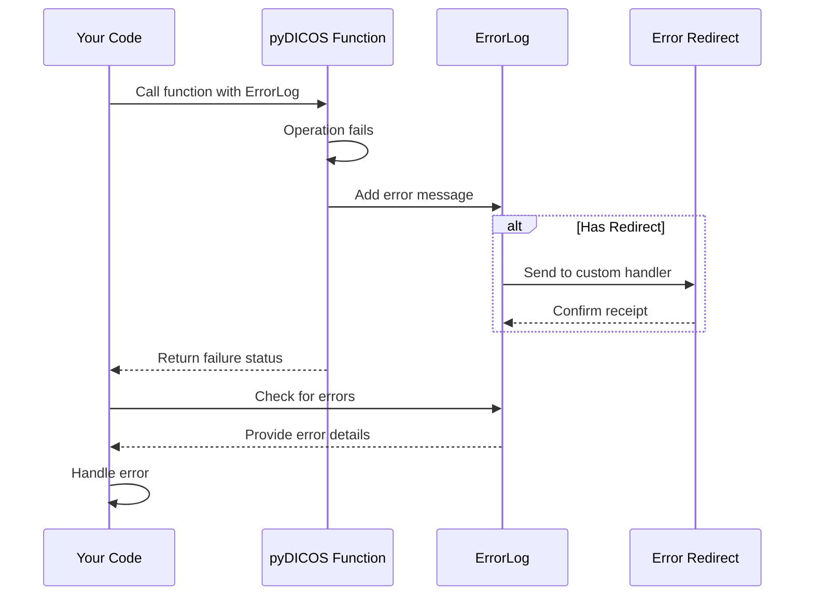

# Chapter 7: Error Handling

In [Chapter 6: Data Processing Callbacks](06_data_processing_callbacks_.md), we learned how to process data as it arrives over a network. However, when working with complex security imaging systems, things don't always go as planned. Files might be corrupted, network connections can drop, or algorithms might encounter unexpected data. This is where proper error handling becomes essential.

## Why is Error Handling Important?

Imagine you're operating a security checkpoint at an airport. If a scanner encounters an error, you need to know:

1. What exactly went wrong?
2. How serious is the problem?
3. Should the checkpoint be temporarily closed?
4. What steps should be taken to fix the issue?

Without good error handling, you might miss critical security threats or unnecessarily halt operations.

## The ErrorLog Class: Your Error Management System

pyDICOS provides a robust error handling system through the `ErrorLog` class. Think of it as a digital logbook that records any issues that occur during operation. Just like a pilot's logbook records flight issues, the `ErrorLog` captures problems in your security imaging operations.

```python
from pyDICOS import ErrorLog, CTLoader

# Create an error log
error_log = ErrorLog()

# Try to load a file that might not exist
ct_loader = CTLoader()
if not ct_loader.read("possibly_missing_file.ct", error_log):
    print("Could not load the file")
    
    # Check if we have errors
    if error_log.NumErrors() > 0:
        print(f"Found {error_log.NumErrors()} errors:")
        print(error_log.GetErrorLog())  # Print the full error log
```

This code creates an `ErrorLog` and passes it to the `read` method. If the file can't be loaded, we check for errors and display them. This is much more helpful than just knowing that something failed - we know exactly what went wrong.

## Distinguishing Between Errors and Warnings

pyDICOS differentiates between two types of issues:

- **Errors**: Critical issues that prevent an operation from completing (e.g., missing file)
- **Warnings**: Non-critical issues that allow operation to continue but might affect results (e.g., unexpected data format)

You can check and handle each type separately:

```python
# Check for both errors and warnings
if error_log.NumErrors() > 0:
    print(f"Critical Issues: {error_log.NumErrors()} errors found")
    
if error_log.NumWarnings() > 0:
    print(f"Minor Issues: {error_log.NumWarnings()} warnings found")
    
# You can decide how to respond based on severity
if error_log.NumErrors() > 0:
    print("Operation failed - need administrator attention")
elif error_log.NumWarnings() > 0:
    print("Operation completed with warnings - results may be affected")
else:
    print("Operation completed successfully")
```

This approach lets you respond appropriately to different levels of issues - critical errors might require immediate attention, while warnings might just need a note in your report.

## Getting Detailed Error Information

To get the full details of what went wrong, you have a few options:

### Option 1: Get the complete error log as a string

```python
# Get the complete error log as a string
complete_log = error_log.GetErrorLog()
print(complete_log)  # Prints all errors and warnings
```

### Option 2: Get separate lists of errors and warnings

```python
# Create arrays to hold the error and warning messages
error_messages = []
warning_messages = []

# Fill the arrays with messages from the error log
error_log.GetErrorLog(error_messages, warning_messages)

# Now you can process them separately
print("ERRORS:")
for error in error_messages:
    print(f"- {error}")
    
print("\nWARNINGS:")
for warning in warning_messages:
    print(f"- {warning}")
```

This second approach is particularly useful when you need to handle errors and warnings differently or display them in separate sections of a user interface.

## Saving Error Logs to File

In production environments, you often want to save error logs to files for later analysis. pyDICOS makes this simple:

```python
# Save the error log to a file
error_log.WriteLog("security_system_errors.log")
print("Error log saved to file for later analysis")
```

This creates a text file containing all errors and warnings, which can be extremely valuable for:
- Troubleshooting complex issues
- Providing information to technical support
- Creating audit trails for security incidents

## Advanced: Redirecting Error Logs

In larger systems, you might want to route error messages to different places - like a central monitoring dashboard or an email alert system. pyDICOS allows you to redirect error logs:

```python
from pyDICOS import ErrorLog, REDIRECT_LOG_TYPE

# Define a function to handle redirected logs
def my_error_handler(message, log_type):
    if log_type == REDIRECT_LOG_TYPE.enumRedirect_Error:
        print(f"CRITICAL ERROR: {message}")
        # You could send an email alert here
    else:  # It's a warning
        print(f"WARNING: {message}")
        # You could log to a database here
    return True  # Return True to indicate successful handling

# Set up the redirect
ErrorLog.SetErrorLogRedirect(my_error_handler)
```

Once you've set up a redirect, all error and warning messages will be sent to your custom handler function. This is particularly useful for integrating pyDICOS with larger monitoring systems.

## Under the Hood: How Error Handling Works

Let's look at what happens behind the scenes when an error occurs in pyDICOS:



When you call a pyDICOS function with an `ErrorLog` parameter, the function records any errors or warnings in that log. If something goes wrong, the function returns a failure status (usually `False` or `None`), and you can then check the error log for details about what happened.

Inside the C++ code, the `ErrorLog` class maintains two lists: one for errors and one for warnings. Each message gets added to the appropriate list, and if a redirect function is set, the message is also sent to that function.

Let's look at a simplified version of what happens in the C++ code:

```cpp
// When an error occurs in a pyDICOS function
void SomeFunction(ErrorLog& log) {
    try {
        // Try to do something...
    }
    catch (const std::exception& e) {
        // Add the error message to the log
        log.AddError(e.what());
        return false;  // Indicate failure
    }
}

// Inside the ErrorLog class
void ErrorLog::AddError(const char* message) {
    // Add to internal list
    m_errors.push_back(message);
    
    // If redirect is enabled, send to custom handler
    if (HasRedirect() && !m_ignoreRedirect) {
        m_redirectFunc(message, REDIRECT_LOG_TYPE::enumRedirect_Error);
    }
}
```

This design makes error handling in pyDICOS both flexible and powerful.

## Example: Creating a Robust Security Scanner

Let's put everything together to create a more robust version of the security scanner from previous chapters:

```python
from pyDICOS import CTLoader, ErrorLog
import os

def scan_luggage(luggage_id):
    """Scan luggage and handle potential errors properly"""
    # Create an error log
    error_log = ErrorLog()
    
    # Create a filename for this scan
    filename = f"luggage_{luggage_id}.ct"
    
    # Try to perform the scan
    print(f"Scanning luggage {luggage_id}...")
    ct_loader = CTLoader()
    
    # In a real system, this would interface with hardware
    # For this example, we'll simulate by checking if file exists
    if not os.path.exists(filename):
        # Simulate scan error
        error_log.AddError(f"Scanner hardware error: Could not complete scan for {luggage_id}")
        return None, error_log
        
    # Try to load the scan
    if not ct_loader.read(filename, error_log):
        return None, error_log
        
    return ct_loader, error_log
```

We can use this function in a more complete error-handling workflow:

```python
def process_luggage(luggage_id):
    # Attempt to scan the luggage
    ct_scan, error_log = scan_luggage(luggage_id)
    
    # Check for serious errors
    if error_log.NumErrors() > 0:
        print(f"Error scanning luggage {luggage_id}:")
        print(error_log.GetErrorLog())
        
        # Log the error for later analysis
        error_log.WriteLog(f"error_luggage_{luggage_id}.log")
        
        # Handle based on error severity
        if "hardware error" in error_log.GetErrorLog():
            print("CRITICAL: Hardware failure - system needs maintenance")
            return "MAINTENANCE_REQUIRED"
        else:
            print("ERROR: Scan failed - luggage needs manual inspection")
            return "MANUAL_INSPECTION"
    
    # Check for warnings
    if error_log.NumWarnings() > 0:
        print(f"Scan completed with warnings for luggage {luggage_id}:")
        print(error_log.GetErrorLog())
        return "PROCEED_WITH_CAUTION"
    
    # All good
    print(f"Scan completed successfully for luggage {luggage_id}")
    return "PROCEED"
```

This approach provides a systematic way to handle different error scenarios in a security screening context.

## Best Practices for Error Handling

Based on what we've learned, here are some best practices for error handling in pyDICOS:

1. **Always use an ErrorLog**: Pass an `ErrorLog` to functions that accept it
2. **Check both errors and warnings**: Different severity levels need different responses
3. **Save logs for critical errors**: Use `WriteLog` to keep records of serious issues
4. **Be specific in custom error handlers**: Tailor responses to specific error types
5. **Implement appropriate fallbacks**: Have a plan for when errors occur

## Summary

In this chapter, we've learned about pyDICOS's error handling system:

- The `ErrorLog` class captures both errors and warnings during operations
- You can distinguish between critical errors and non-critical warnings
- Error details can be retrieved as a single string or as separate lists
- Logs can be saved to files for later analysis
- Error messages can be redirected to custom handlers for integration with other systems

Proper error handling is crucial in security imaging applications, where failures can have serious consequences. With pyDICOS's error handling system, you can build more robust applications that gracefully handle unexpected situations.

In the next chapter, [Memory Management](08_memory_management_.md), we'll learn how to efficiently manage memory when working with large security scan data, ensuring your applications run smoothly even with limited resources.

---

Generated by [AI Codebase Knowledge Builder](https://github.com/The-Pocket/Tutorial-Codebase-Knowledge)