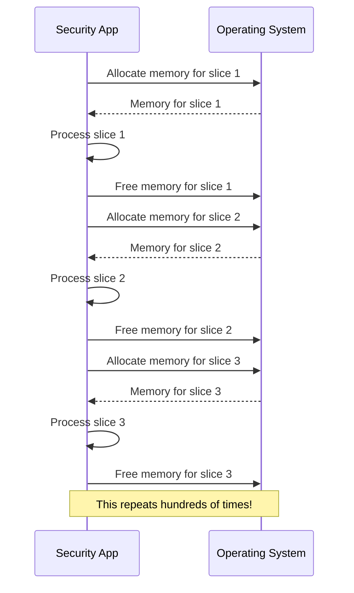
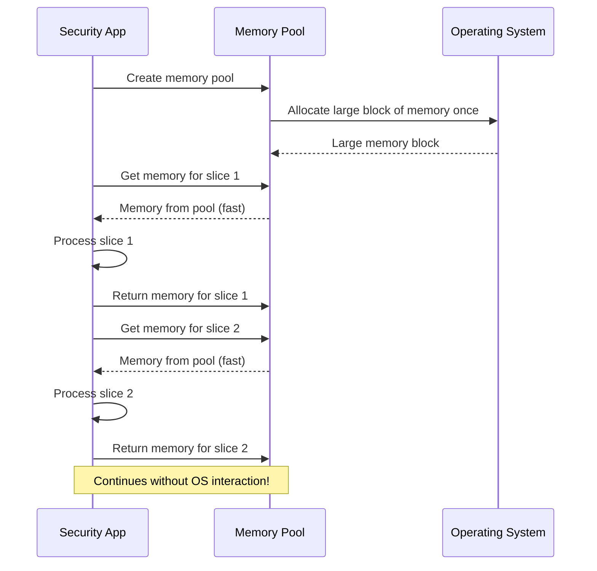
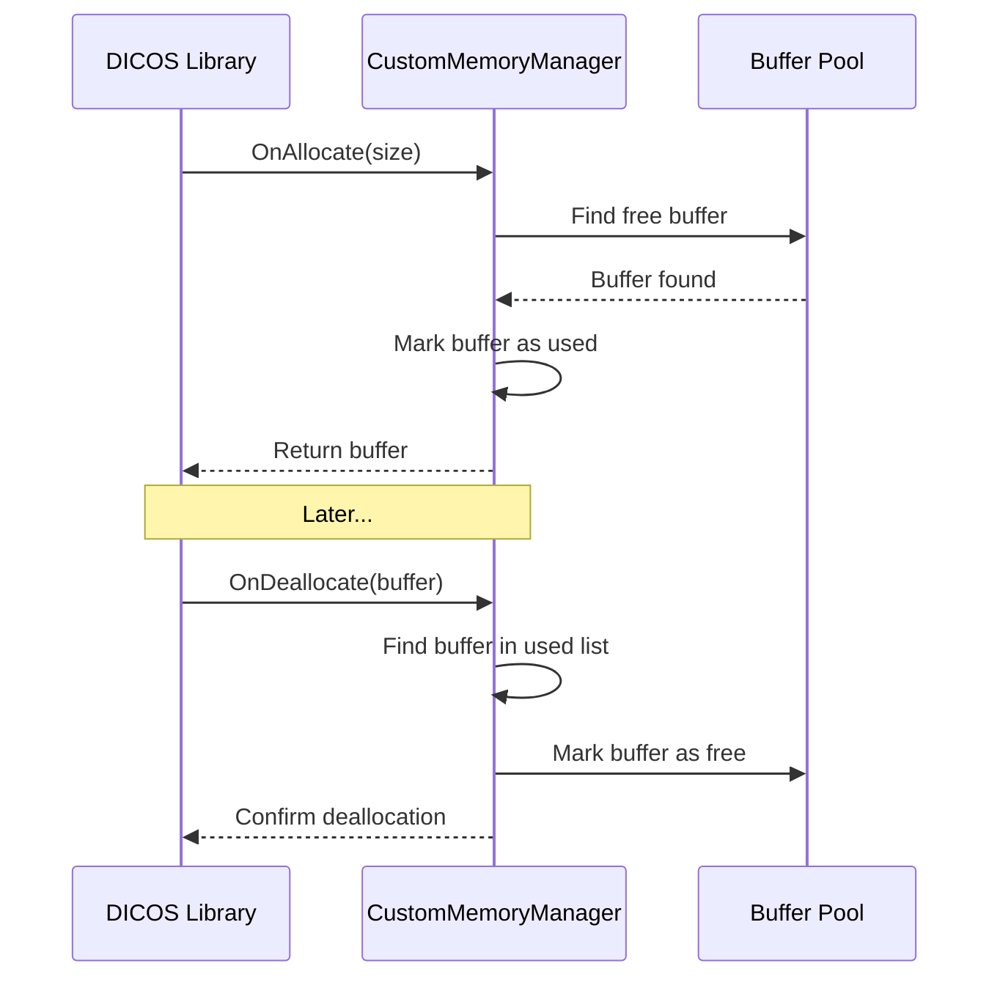

# Chapter 8: Memory Management

In [Chapter 7: Error Handling](07_error_handling_.md), we learned how to gracefully handle errors that might occur in our security imaging applications. Now, let's explore another critical aspect of building robust security scanning systems: efficiently managing memory.

## Why Memory Management Matters

Imagine you're trying to view and analyze a CT scan of a large suitcase at an airport security checkpoint. A typical CT scan might contain:

- 512 × 512 pixels per slice
- 600 or more slices in a single scan
- 2 bytes (16 bits) per voxel

Doing the math: 512 × 512 × 600 × 2 bytes = 314,572,800 bytes or about **300 MB** for a single scan!

Now imagine your security system needs to process multiple bags per minute, perhaps running complex threat detection algorithms on each scan. Without proper memory management, your application might:

- Slow down due to constant memory allocation and deallocation
- Run out of memory entirely
- Experience fragmentation (where small unusable gaps form in memory)
- Crash at the worst possible moment

This is where pyDICOS's memory management system comes to the rescue!

## The Problem: Constant Allocation and Deallocation

To understand the problem better, let's look at what happens in a naive approach:



Each memory allocation and deallocation operation takes time. When you're processing hundreds of slices in a CT scan, these operations add up and slow down your application.

## The Solution: Memory Pools

Instead of constantly asking the operating system for memory, pyDICOS uses a "memory pool" approach:



This approach is like having a pre-filled water cooler instead of going to the store each time you need a drink. It's much more efficient!

## The CustomMemoryManager Class

The core of pyDICOS's memory management is the `CustomMemoryManager` class. Think of it as a smart warehouse manager that:

1. Sets up a warehouse (memory pool) at the beginning
2. Keeps track of which spaces are occupied or free
3. Quickly provides space when needed
4. Reclaims space when it's no longer needed

Here's how to create and use a custom memory manager:

```python
from pydicos import CustomMemoryManager, CTLoader

# Create a memory manager with:
# - 8MB buffer size (enough for one slice)
# - 500 buffers (enough for a whole scan)
memory_manager = CustomMemoryManager(8 * 1024 * 1024, 500)

# Create a CT loader that uses the memory manager
ct_loader = CTLoader()
ct_loader.SetMemoryManager(memory_manager)

# Now when you load a scan, it will use the memory manager
ct_loader.read("large_baggage_scan.ct")

# Process the scan...
volume = ct_loader.get_volume_data()
# (do analysis here)
```

By setting up the memory manager before loading your scan, you're instructing pyDICOS to use your pre-allocated memory pool instead of constantly requesting memory from the operating system.

## How the Memory Manager Works

Let's see what happens when pyDICOS needs memory for a new slice:



When the DICOS library needs memory, it calls `OnAllocate()` on your memory manager. The manager finds an available buffer in its pool, marks it as used, and returns it. When the library is done with the buffer, it calls `OnDeallocate()`, and the manager marks the buffer as available again.

This cycle of allocation and deallocation happens entirely within your memory manager, without expensive operating system calls.

## A Simple Example: Memory Pool for Image Processing

Let's create a simple example that shows the benefit of memory management when processing a series of images:

```python
from pydicos import CustomMemoryManager, Array2DUInt16
import time

def process_without_memory_manager():
    start_time = time.time()
    # Process 500 images without memory management
    for i in range(500):
        # Allocate memory for each image
        image = Array2DUInt16(512, 512)
        # Fill it with some data
        for x in range(512):
            for y in range(512):
                image.Set(x, y, x + y)
        # Image is automatically deleted here, memory deallocated
    return time.time() - start_time

def process_with_memory_manager():
    # Create a memory manager
    mem_manager = CustomMemoryManager(512 * 512 * 2, 10)
    start_time = time.time()
    
    # Process 500 images with memory management
    for i in range(500):
        # Get memory from the pool (reusing previously allocated memory)
        # Note: This is simplified; in real code, you'd use CTLoader with SetMemoryManager
        image = Array2DUInt16(512, 512)
        # Fill it with some data
        for x in range(512):
            for y in range(512):
                image.Set(x, y, x + y)
        # Image is returned to the pool, not deallocated
    return time.time() - start_time

# Compare the performance
time_without = process_without_memory_manager()
time_with = process_with_memory_manager()

print(f"Time without memory manager: {time_without:.2f} seconds")
print(f"Time with memory manager: {time_with:.2f} seconds")
print(f"Speedup: {time_without / time_with:.2f}x")
```

This example is simplified, but it demonstrates the concept. In a real pyDICOS application, you'd use `SetMemoryManager()` on your loaders rather than directly using the memory manager.

## Memory Management in Real-World Scanning Applications

Let's look at a more realistic example in a security scanning context:

```python
from pydicos import CTLoader, CustomMemoryManager, dcsread
import numpy as np

# Set up a memory manager for a typical CT scan
slice_size = 512 * 512 * 2  # 512x512 pixels, 2 bytes per pixel
num_slices = 600  # Typical number of slices in a CT scan
mem_manager = CustomMemoryManager(slice_size, num_slices)

# Function to analyze a batch of scans
def analyze_scans(scan_files):
    # Set up a CT loader with our memory manager
    loader = CTLoader()
    loader.SetMemoryManager(mem_manager)
    
    results = []
    for scan_file in scan_files:
        print(f"Processing {scan_file}...")
        
        # Read the scan using our memory-managed loader
        loader.read(scan_file)
        
        # Get the volume data for analysis
        volume = loader.get_volume_data()
        
        # Perform analysis (simplified example)
        avg_density = np.mean(volume)
        max_density = np.max(volume)
        
        results.append({
            'file': scan_file,
            'average_density': avg_density,
            'maximum_density': max_density
        })
        
    return results

# Analyze a batch of scans
scan_files = ['bag1.ct', 'bag2.ct', 'bag3.ct', 'bag4.ct', 'bag5.ct']
results = analyze_scans(scan_files)

# Print results
for result in results:
    print(f"Scan: {result['file']}")
    print(f"  Average density: {result['average_density']:.2f}")
    print(f"  Maximum density: {result['maximum_density']:.2f}")
```

In this example, we create a memory manager sized appropriately for our CT scans. We then use this manager across multiple scans, which allows us to efficiently reuse memory rather than constantly allocating and deallocating it.

## Under the Hood: How CustomMemoryManager Works

Let's explore how `CustomMemoryManager` works internally by looking at its implementation.

When you create a `CustomMemoryManager`, it pre-allocates a pool of memory buffers:

```cpp
CustomMemoryManager::CustomMemoryManager(const SDICOS::S_UINT64 m_nBufferSizeInBytes, 
                                        const SDICOS::S_UINT32 nNumBuffersToAllocated)
	: m_nBufferSizeInBytes(m_nBufferSizeInBytes)
{
	m_vBuffers.SetSize(nNumBuffersToAllocated); //Allocate a set number of buffers

	std::pair<bool, SDICOS::MemoryBuffer> *pBuffer(m_vBuffers.GetBuffer());

	//Initialize each buffer to the indicated size and mark them as available
	for (SDICOS::S_UINT32 n(0); n < nNumBuffersToAllocated; ++n, ++pBuffer)
	{
		pBuffer->first = true;  // Mark as available
		pBuffer->second.GrowTo(m_nBufferSizeInBytes);  // Allocate memory
	}
}
```

This code creates an array of buffers and initializes each one. The `first` element of each pair is a boolean flag that indicates if the buffer is available (true) or in use (false). The `second` element is the actual memory buffer.

When the DICOS library needs memory, it calls `OnAllocate`:

```cpp
bool CustomMemoryManager::OnAllocate(SDICOS::MemoryBuffer &mbAllocate, 
                                    const SDICOS::S_UINT64 nSizeInBytesToAllocate)
{
	//Check if the requested buffer size is too large
	if (m_nBufferSizeInBytes <= nSizeInBytesToAllocate)
	{
		return false;  // Let DICOS handle it
	}

	//Find an available buffer
	std::pair<bool, SDICOS::MemoryBuffer> *pBuffer(m_vBuffers.GetBuffer());
	for (SDICOS::S_UINT32 n(0); n < m_vBuffers.GetSize(); ++n, ++pBuffer)
	{
		if (pBuffer->first)  // If buffer is available
		{
			//Mark as used and provide to DICOS
			pBuffer->first = false;
			mbAllocate.SetBuffer(pBuffer->second.GetData(), nSizeInBytesToAllocate);
			m_mapUsedBuffers[pBuffer->second.GetData()] = n;
			return true;
		}
	}

	//No more buffers available
	return false;
}
```

This function:
1. Checks if the requested size is too large for our pre-allocated buffers
2. Looks for an available buffer in the pool
3. If found, marks it as used and provides it to the DICOS library
4. Keeps track of which buffer was allocated in the `m_mapUsedBuffers` map

When the DICOS library is done with a buffer, it calls `OnDeallocate`:

```cpp
bool CustomMemoryManager::OnDeallocate(SDICOS::MemoryBuffer &mbDeallocate)
{
	//If memory policy doesn't match, the buffer wasn't allocated by this class
	if (GetSliceMemoryPolicy() != mbDeallocate.GetMemoryPolicy())
		return false;

	//Find the buffer in our "used" list
	auto it = m_mapUsedBuffers.find(mbDeallocate.GetData());
	if (m_mapUsedBuffers.end() == it)
		return false;

	//Mark buffer as available again
	m_vBuffers[it->second].first = true;
	m_mapUsedBuffers.erase(it);
	return true;
}
```

This function:
1. Verifies that the buffer was allocated by this memory manager
2. Finds the buffer in the "used" list
3. Marks it as available again
4. Removes it from the "used" list

The key insight is that neither `OnAllocate` nor `OnDeallocate` actually creates or destroys memory - they just manage a pool of pre-allocated buffers.

## Common Pitfalls and Best Practices

### 1. Sizing Your Memory Manager

When creating a memory manager, it's important to size it appropriately:

```python
# For a 512x512 CT scan with 600 slices (2 bytes per voxel)
slice_size = 512 * 512 * 2  # ~0.5 MB per slice
num_slices = 600  # Total number of slices
mem_manager = CustomMemoryManager(slice_size, num_slices)
```

If you make the buffers too small, they won't be used. If you allocate too many buffers, you might waste memory.

### 2. Memory Policies

The `CustomMemoryManager` uses a specific memory policy:

```python
from pyDICOS import MEMORY_POLICY

# The memory manager uses POLICY_DoesNotOwnData
# This tells the DICOS library not to try deleting our pooled memory
policy = MEMORY_POLICY.enumPolicy_DoesNotOwnData
```

Understanding memory policies is important for advanced usage, but for most applications, the default behavior of `CustomMemoryManager` is appropriate.

### 3. Thread Safety

Be careful when using the same memory manager from multiple threads:

```python
# DON'T do this without proper synchronization
from threading import Thread

def process_scan(scan_file, mem_manager):
    loader = CTLoader()
    loader.SetMemoryManager(mem_manager)
    loader.read(scan_file)
    # Process the scan...

# This could cause problems if both threads try to use the same buffer
thread1 = Thread(target=process_scan, args=('scan1.ct', mem_manager))
thread2 = Thread(target=process_scan, args=('scan2.ct', mem_manager))
```

For multithreaded applications, consider using separate memory managers for each thread or implementing proper synchronization.

## Summary

In this chapter, we've explored pyDICOS's memory management system:

- We learned why memory management is crucial for efficient processing of large 3D scans
- We saw how the `CustomMemoryManager` class pre-allocates and reuses memory buffers
- We examined how to integrate memory management with loaders like `CTLoader`
- We looked under the hood to understand how memory allocation and deallocation work
- We discussed best practices for using memory management effectively

By using pyDICOS's memory management system, you can significantly improve the performance of your security scanning applications, especially when dealing with large datasets like CT scans.

Memory management completes our tour of the core components of pyDICOS. You now have a comprehensive understanding of how to work with security scan data efficiently, from loading and saving files to network transmission, data processing, error handling, and memory management.

You now have all the tools you need to build robust, efficient security scanning applications with pyDICOS. Happy coding!

---

Generated by [AI Codebase Knowledge Builder](https://github.com/The-Pocket/Tutorial-Codebase-Knowledge)