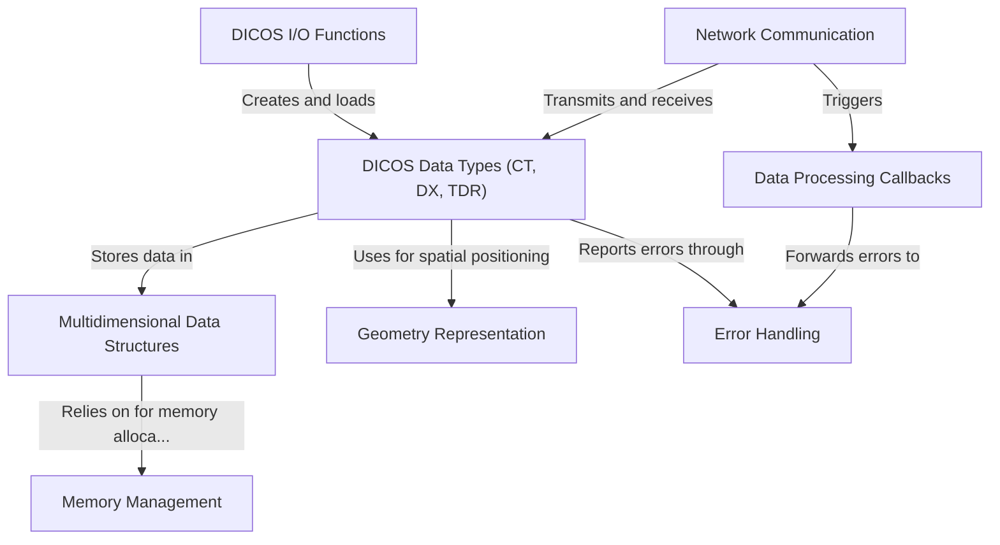

# Tutorial: pyDICOS

**pyDICOS** is a Python library for working with **DICOS** (Digital Imaging and Communications for Security) data - a standard for security screening images. It provides tools to read, write, and process security imaging data like **CT scans** (3D baggage scans), **DX** (2D X-rays), and **TDR** (Threat Detection Reports). The library enables both file operations and real-time network transmission of security scan data, making it useful for developing advanced security screening applications and threat detection systems.

**pydicos** is a python wrapper over Stratovan's C++ implementation and offer high level API. Original C++ API translation is accessible via the **pyDICOS** library.

**Source Repository:** [https://github.com/Auxilia-tech/pyDICOS](https://github.com/Auxilia-tech/pyDICOS)

## Chapters

1. [DICOS Data Types (CT, DX, TDR)
](01_dicos_data_types__ct__dx__tdr__.html)
2. [DICOS I/O Functions
](02_dicos_i_o_functions_.html)
3. [Network Communication
](03_network_communication_.html)
4. [Multidimensional Data Structures
](04_multidimensional_data_structures_.html)
5. [Geometry Representation
](05_geometry_representation_.html)
6. [Data Processing Callbacks
](06_data_processing_callbacks_.html)
7. [Error Handling
](07_error_handling_.html)
8. [Memory Management
](08_memory_management_.html)

---

Generated by [AI Codebase Knowledge Builder](https://github.com/The-Pocket/Tutorial-Codebase-Knowledge)
